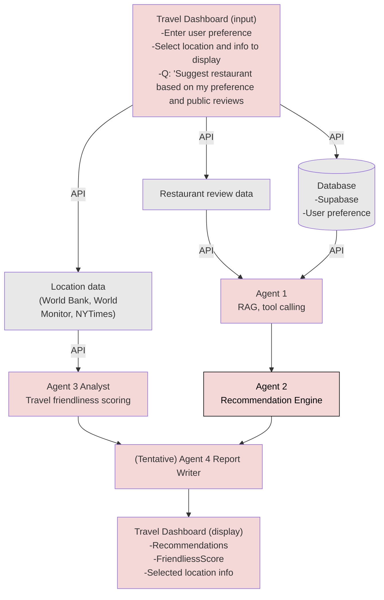

<!-- This file is generated. Edit README.template.md and docs/architecture.md, then run: npm run readme -->

# Travel Dashboard

Web app for planning trips, tracking places, and viewing travel context in one UI.

## Repository

Source of truth on GitHub: [https://github.com/JanHsuanChu/TravelDashboard](https://github.com/JanHsuanChu/TravelDashboard)

Clone:

```bash
git clone https://github.com/JanHsuanChu/TravelDashboard.git
cd TravelDashboard
```

If you already have this folder inside another workspace, push from here:

```bash
cd TravelDashboard
git remote -v   # should show origin -> JanHsuanChu/TravelDashboard
git push -u origin main
```

(Create an empty repo on GitHub first if it does not exist yet, then push.)

## Development

Requires [Node.js](https://nodejs.org/) 18+ and npm.

```bash
npm install
npm run dev
```

Open the URL Vite prints (usually `http://localhost:5173`).

```bash
npm run build    # production build to dist/
npm run preview  # serve dist locally
npm run readme    # regenerate README.md from docs/architecture.md (see Architecture section)
```

## Stack

- [Vite](https://vitejs.dev/) + [React](https://react.dev/) + [TypeScript](https://www.typescriptlang.org/) (optional web client)
- [Shiny for Python](https://shiny.posit.co/py/) — dashboard in [`shiny_app/`](shiny_app/) (Bootstrap-style cards via `ui.card` / `ui.layout_columns`)

## Python Shiny dashboard

Browser-only app: trip/compare/when inputs (UI-only for now), food preferences saved to Supabase `preference`, optional **Generate** calls **Ollama Cloud** `gpt-oss:20b-cloud` with [`docs/architecture.md`](docs/architecture.md) as context.

**Paths:** `requirements.txt` and `app.py` live in **`shiny_app/`** inside this repo. If `cd TravelDashboard/shiny_app` fails, your shell is not in the parent of `TravelDashboard` (for example you might be in `TravelDashboard` already — then use `cd shiny_app` only, or use the absolute path to `TravelDashboard/shiny_app`).

**Do not** run `export SUPABASE_*=...` in zsh with a bare `*` — set real names, e.g. `export SUPABASE_URL="..."` and `export SUPABASE_KEY="..."`, or put them in `shiny_app/.env`.

```bash
# From the TravelDashboard repo root (the folder that contains shiny_app/):
cd shiny_app
python3 -m venv .venv
source .venv/bin/activate   # Windows: .venv\Scripts\activate
pip install -r requirements.txt
cp .env.example .env        # add SUPABASE_URL, SUPABASE_KEY, OLLAMA_API_KEY
shiny run app.py --reload
```

Or from the repo root, after the venv above exists and `shiny` is on your PATH:

```bash
chmod +x run_shiny.sh
./run_shiny.sh
```

Open the URL Shiny prints (usually `http://127.0.0.1:8000`).

## Architecture

The diagram and legend below are **generated** from [`docs/architecture.md`](docs/architecture.md). Edit that file, then run `npm run readme` to refresh `README.md`. CI also regenerates `README.md` when `docs/architecture.md` or `README.template.md` changes.

### Travel Dashboard — architecture (reference)

This diagram captures the intended data flow and agent pipeline. Use it when planning features, APIs, and UI surfaces.



## Legend (quick read)

| Area | Role |
|------|------|
| **Travel Dashboard (input)** | Preferences, location selection, display choices, natural-language questions (e.g. restaurant suggestions). |
| **Supabase** | Stores user preferences; feeds Agent 1. |
| **Restaurant review data** | External/API input to Agent 1 (RAG + tools). |
| **Location data** | World Bank, World Monitor, NYTimes, etc. → Agent 3 Analyst (friendliness scoring). |
| **Agent 1 → Agent 2** | RAG/tool calling → recommendation engine. |
| **Agent 3 → Agent 4** | Analyst → (tentative) report writer. |
| **Travel Dashboard (display)** | Recommendations, friendliness score, selected location info. |


## Supabase

**Project URL:** `https://stnfxxjktzznvlfhczcz.supabase.co`  
**Project reference (for MCP):** `stnfxxjktzznvlfhczcz`

### Schema

#### `app_user`

| Column | Type | Constraints |
|--------|------|-------------|
| `user_id` | `UUID` | Primary key, default `gen_random_uuid()` |
| `first_name` | `TEXT` | not null |
| `email` | `TEXT` | not null, unique |
| `created_at` | `TIMESTAMPTZ` | not null, default `now()` |

#### `preference`

| Column | Type | Constraints |
|--------|------|-------------|
| `preference_id` | `BIGINT` | Primary key, generated identity |
| `user_id` | `UUID` | not null, FK → `app_user(user_id)` (cascade on delete) |
| `created_at` | `TIMESTAMPTZ` | not null, default `now()` |
| `dietary_restrictions` | `TEXT` | nullable (third food free-text field; UI max 50 words) |
| `dining_preference` | `TEXT` | nullable |
| `food_like_text` | `TEXT` | nullable (UI max 50 words) |
| `food_dislike_text` | `TEXT` | nullable (UI max 50 words) |
| `food_tags` | `JSONB` | not null, default `{}` — preset checkbox slugs: `like` / `dislike` / `dietary` arrays |

Index: `idx_preference_user_created_at` on `(user_id, created_at DESC)`.

### Apply migrations

Run in order:

1. [`supabase/migrations/001_app_user_preference.sql`](supabase/migrations/001_app_user_preference.sql)
2. [`supabase/migrations/002_preference_food_text.sql`](supabase/migrations/002_preference_food_text.sql)

- **Option A: Supabase Dashboard (SQL Editor)**: paste each file and **Run**.
- **Option B: Supabase MCP**: `apply_migration` / `execute_sql` with the same SQL.

## Layout

- **React (Vite):** `src/`
- **Shiny (Python):** `shiny_app/` (`app.py`, `ui.py`, `server.py`, `ui/` fragments, `www/custom.css`)
