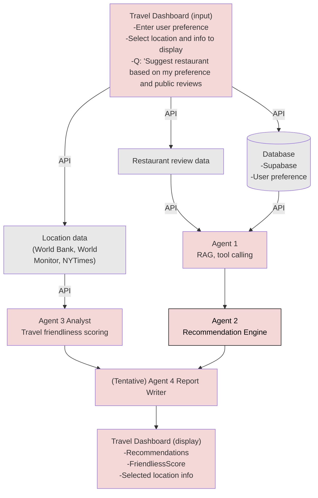
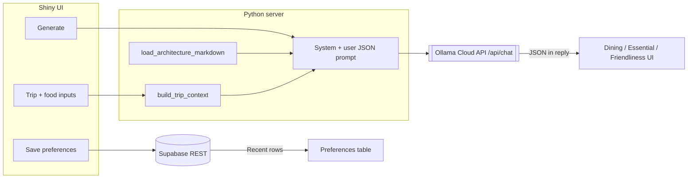

<!-- Generated by scripts/build_readme.py from README.template.md + docs/architecture.md -->

# Travel Dashboard

Web app for planning trips, capturing food preferences, and generating structured travel recommendations in one UI. This README includes **app description**, **process diagrams**, and **technical documentation** for developers and stakeholders.

<p align="center">
  
</p>

| | Purple | Pink | Soft | Yellow | Cyan |
| :-- | :--: | :--: | :--: | :--: | :--: |
| **Hex** | `#AC85E9` | `#FF6C9D` | `#FFA3C8` | `#FDE164` | `#01E1F2` |

These colors match the Shiny UI (`shiny_app/www/custom.css`) and documentation visuals.

## Repository

Source of truth on GitHub: [https://github.com/JanHsuanChu/TravelDashboard](https://github.com/JanHsuanChu/TravelDashboard)

Clone:

```bash
git clone https://github.com/JanHsuanChu/TravelDashboard.git
cd TravelDashboard
```

If you already have this folder inside another workspace, push from here:

```bash
cd TravelDashboard
git remote -v   # should show origin -> JanHsuanChu/TravelDashboard
git push -u origin main
```

(Create an empty repo on GitHub first if it does not exist yet, then push.)

## App description and documentation

### Description

**What it does:** The Travel Dashboard is a **Shiny for Python** browser app where users enter a destination, optional compare locations, season or month, and detailed **food preferences** (preset tags plus short free text). Users can **save** preferences to the database and **generate** a structured “plan” with dining ideas, essential travel-style notes, and a **travel friendliness** panel (World Bank–based scores and HTML report, separate from the LLM) alongside two other output panels.

**APIs in use:**

| API / service | Purpose |
|----------------|---------|
| **Supabase** (PostgREST via `supabase-py`) | Persist `app_user` and `preference` rows; resolve returning users and load latest preferences by email. |
| **Ollama Cloud** (`POST …/api/chat`) | Single chat completion that returns JSON-shaped content for the plan (default model **`gpt-oss:20b-cloud`**). |
| **World Bank API** (`api.worldbank.org/v2`) | Latest values per indicator for travel friendliness scoring and the detailed HTML report (see [`docs/travel_friendliness.md`](docs/travel_friendliness.md)). |

**Features and how they add value:**

| Capability | Status | Value |
|------------|--------|--------|
| **Preference storage** | Implemented | Travelers retain food likes/dislikes and dietary tags; product/analytics can segment users by `food_tags` JSONB. |
| **Generate recommendations** | Implemented | One-shot structured output (dining / essential / friendliness) without standing up a custom model host (Ollama Cloud). |
| **Architecture context in the prompt** | Implemented | `docs/architecture.md` is injected into the system message so the model follows the intended product vocabulary and JSON shape. |
| **Agentic orchestration (multi-agent pipeline)** | **Roadmap** (see target diagram below) | Future: separate agents for RAG, recommendations, and reporting—clearer roles and evals for engineering. |
| **RAG / tool calling** | **Roadmap** (see below) | Future: retrieval over reviews and tools for live data; today the app uses **full-document context injection**, not vector search. |

**Stakeholders:** **Travelers** get a single place for preferences and AI-assisted suggestions; **developers** get a small, inspectable stack (Shiny + Supabase + one LLM endpoint) that can grow toward the multi-agent design in `docs/architecture.md`.

**Preference UX (identity, returning users, Save vs Generate):** see [`docs/ui_flow_preferences.md`](docs/ui_flow_preferences.md).

### Process diagram and architecture reference

The content below is **generated** from [`docs/architecture.md`](docs/architecture.md). It includes the **target** pipeline (agents, RAG, tools) and a **current** Shiny data-flow diagram. Edit that file, then run `python3 scripts/build_readme.py` to refresh `README.md`. CI also regenerates `README.md` when `docs/architecture.md` or `README.template.md` changes.

The **first** diagram is the **target** pipeline (multi-agent orchestration, RAG, external tools). The **second** diagram is the **current** Shiny prototype (single LLM call, Supabase, injected architecture context).

#### Target pipeline (agentic orchestration, RAG, tool calling)

This is the roadmap: specialized agents, retrieval from reviews and location APIs, and a report path to the dashboard UI.



#### Legend (target pipeline)

| Area | Role |
|------|------|
| **Travel Dashboard (input)** | Preferences, location selection, display choices, natural-language questions (e.g. restaurant suggestions). |
| **Supabase** | Stores user preferences; feeds Agent 1. |
| **Restaurant review data** | External/API input to Agent 1 (RAG + tools). |
| **Location data** | World Bank, World Monitor, NYTimes, etc. → Agent 3 Analyst (friendliness scoring). |
| **Agent 1 → Agent 2** | RAG/tool calling → recommendation engine. |
| **Agent 3 → Agent 4** | Analyst → (tentative) report writer. |
| **Travel Dashboard (display)** | Recommendations, friendliness score, selected location info. |

#### Current implementation (Shiny prototype — data flow)

What runs today: one **Ollama Cloud** chat completion per **Generate** click; **no** separate agent processes, **no** vector RAG index. `docs/architecture.md` is loaded **in full** as static system context (prompt injection), not retrieved by similarity search.




### Technical documentation

#### System architecture (roles and workflow)

| Piece | Responsibility |
|-------|------------------|
| **UI** ([`shiny_app/ui.py`](shiny_app/ui.py), [`shiny_app/components/`](shiny_app/components/)) | Layout: trip inputs, food preferences, save/generate actions, three output panels. |
| **Server** ([`shiny_app/server.py`](shiny_app/server.py)) | Reactive logic: debounced email preload; validate inputs; **Save** → get/create user + insert `preference`; **Generate** → World Bank travel friendliness (destination + optional compare countries), then insert `preference` when first name + email + food fields validate, then build trip JSON context, call Ollama for dining/essential (friendliness scores from the model JSON are ignored). |
| **`plan_logic`** ([`shiny_app/plan_logic.py`](shiny_app/plan_logic.py)) | Builds the trip/food context dict and the user prompt; defines the required JSON schema for the model. |
| **`context`** ([`shiny_app/context.py`](shiny_app/context.py)) | Loads `docs/architecture.md` as a string for the system prompt. |
| **`supabase_client`** ([`shiny_app/supabase_client.py`](shiny_app/supabase_client.py)) | Creates Supabase client from env; normalize email + `email_hash`; get/create user; fetch latest preference for returning users; insert preference (append-only). |
| **`ollama_client`** ([`shiny_app/ollama_client.py`](shiny_app/ollama_client.py)) | HTTP POST to Ollama Cloud chat; extracts assistant text and parses embedded JSON when present. |

**Workflow (high level):** Browser → Shiny session → (optional) Supabase reads/writes → on **Generate**, World Bank fetches + scoring for the friendliness panel and report → one round-trip to Ollama with **system** (architecture + JSON contract) + **user** (serialized trip context) messages → parsed JSON drives dining and essential renderers (friendliness UI uses `travel_friendliness` only).

#### RAG and tool implementation

| Topic | Implementation today | Roadmap (aligned with target diagram) |
|-------|----------------------|----------------------------------------|
| **RAG** | **Not implemented as vector search.** The full text of [`docs/architecture.md`](docs/architecture.md) is passed in the **system** message (static context injection). | Index **restaurant review** (and other) corpora; retrieve top-*k* chunks per query to ground recommendations. |
| **Tool calling** | **No tool functions** are registered in code; the model does not call HTTP tools from the runtime. Trip/compare/weather-style fields are **UI-only** except where persisted in Supabase as preferences. | Agent 1-style tools: DB lookup, review APIs, geodata—per target pipeline. |

If you add real tools later, document each **name**, **purpose**, **parameters**, and **return shape** in this section and in code docstrings.

#### Technical details

**Environment variables** (set in [`shiny_app/.env`](shiny_app/.env); copy from [`shiny_app/.env.example`](shiny_app/.env.example)):

| Variable | Required | Purpose |
|----------|----------|---------|
| `SUPABASE_URL` | Yes (save / load) | Supabase project URL. |
| `SUPABASE_KEY` | Yes (save / load) | API key with rights to `app_user` / `preference` (per your RLS policy). |
| `OLLAMA_API_KEY` | Yes (**Generate**) | Bearer token for Ollama Cloud. |
| `OLLAMA_HOST` | No | Base URL for the API (default builds `https://ollama.com/api/chat`). |

**Endpoints (app as client):**

- Supabase: project REST URL from dashboard (used by `supabase-py`).
- Ollama Cloud: `{OLLAMA_HOST or https://ollama.com}/api/chat` — see [`shiny_app/ollama_client.py`](shiny_app/ollama_client.py).

**Packages:** see [`shiny_app/requirements.txt`](shiny_app/requirements.txt) (`shiny`, `supabase`, `requests`, `python-dotenv`, `pandas`, `markdown` for World Bank friendliness).

**Repository layout:**

- **Shiny app:** [`shiny_app/`](shiny_app/) — `app.py`, `ui.py`, `server.py`, `components/`, `www/custom.css`
- **SQL:** [`supabase/migrations/`](supabase/migrations/)
- **Docs / prompt context:** [`docs/architecture.md`](docs/architecture.md)

**Deployment:** The documented path is **local** (`shiny run app.py`). You can host on **Posit Connect**, **Shiny Server**, or a **container**; configure the same environment variables on the host. There is **no app-level password** in this prototype—use platform auth, VPN, or network rules if you expose it beyond localhost.

#### Usage instructions

1. **Environment:** Python 3.10+ recommended. From the repo root:

```bash
cd shiny_app
python3 -m venv .venv
source .venv/bin/activate   # Windows: .venv\Scripts\activate
pip install -r requirements.txt
cp .env.example .env        # set SUPABASE_URL, SUPABASE_KEY, OLLAMA_API_KEY
```

2. **Run:**

```bash
shiny run app.py --reload
```

Or from repo root (after venv is ready): `./run_shiny.sh`

3. **Open** the URL Shiny prints (commonly `http://127.0.0.1:8000`).

4. **Use the UI:** Enter **destination** (country required), optional **compare** cities, **when** (season or month), **food** tags and text, then **Save food preferences** (requires first name + email). Click **Generate recommendations** to call Ollama and refresh the three output panels. Entering a recognized **email** (after a short pause or when leaving the field) preloads your last saved preferences.

**Password:** None for the default local app. If you deploy behind a platform that adds authentication, follow that platform’s login flow.

---

## Development

To regenerate the root `README.md` after editing [`README.template.md`](README.template.md) or [`docs/architecture.md`](docs/architecture.md):

```bash
python3 scripts/build_readme.py
```

## Stack

- [Shiny for Python](https://shiny.posit.co/py/) — dashboard in [`shiny_app/`](shiny_app/)

## Supabase

**Example project URL (public):** `https://stnfxxjktzznvlfhczcz.supabase.co`  
**Project reference (for MCP):** `stnfxxjktzznvlfhczcz`

### Schema

#### `app_user`

| Column | Type | Constraints |
|--------|------|-------------|
| `user_id` | `UUID` | Primary key, default `gen_random_uuid()` |
| `first_name` | `TEXT` | not null |
| `email` | `TEXT` | not null, unique |
| `email_hash` | `TEXT` | not null, unique (SHA-256 hex of normalized email; see migration 004) |
| `created_at` | `TIMESTAMPTZ` | not null, default `now()` |

#### `preference`

| Column | Type | Constraints |
|--------|------|-------------|
| `preference_id` | `BIGINT` | Primary key, generated identity |
| `user_id` | `UUID` | not null, FK → `app_user(user_id)` (cascade on delete) |
| `created_at` | `TIMESTAMPTZ` | not null, default `now()` |
| `food_like_text` | `TEXT` | nullable (UI max 50 words) |
| `food_dislike_text` | `TEXT` | nullable (UI max 50 words) |
| `dietary_restrictions` | `TEXT` | nullable (UI max 50 words) |
| `food_tags` | `JSONB` | not null, default `{}` — preset checkbox slugs: `like` / `dislike` / `dietary` arrays |

Index: `idx_preference_user_created_at` on `(user_id, created_at DESC)`.

#### UI ↔ database mapping (Save)

Saving **food preferences** writes one `preference` row and ensures an `app_user` row. Trip fields (destination, compare, when) and **Generate** output are **not** persisted to these tables today.

| Supabase column / table | Shiny input(s) | Notes |
|-------------------------|----------------|--------|
| `app_user.first_name` | **First name** | Required on Save. |
| `app_user.email` | **Email** | Required on Save; used to find or create `app_user`. |
| `preference.food_like_text` | **Food I like** — detail textarea | Validated to max word count in UI. |
| `preference.food_dislike_text` | **Food I dislike** — detail textarea | Same. |
| `preference.dietary_restrictions` | **Dietary restrictions** — detail textarea | Same. |
| `preference.food_tags` | **Food I like / dislike / Dietary** checkbox groups | Stored as JSON: `{ "like": [...], "dislike": [...], "dietary": [...] }` (slug values from [`shiny_app/tags.py`](shiny_app/tags.py)). |

### Apply migrations

Run in order:

1. [`supabase/migrations/001_app_user_preference.sql`](supabase/migrations/001_app_user_preference.sql)
2. [`supabase/migrations/002_preference_food_text.sql`](supabase/migrations/002_preference_food_text.sql)
3. [`supabase/migrations/003_drop_dining_preference.sql`](supabase/migrations/003_drop_dining_preference.sql) — drops legacy unused `dining_preference` if present
4. [`supabase/migrations/004_app_user_email_hash.sql`](supabase/migrations/004_app_user_email_hash.sql) — adds `app_user.email_hash` (SHA-256 of normalized email) for stable identity

- **Option A: Supabase Dashboard (SQL Editor)**: paste each file and **Run**.
- **Option B: Supabase MCP**: `apply_migration` / `execute_sql` with the same SQL.

## Layout

- **Shiny (Python):** [`shiny_app/`](shiny_app/) — `app.py`, `ui.py`, `server.py`, [`components/`](shiny_app/components/), [`www/custom.css`](shiny_app/www/custom.css)
- **SQL:** [`supabase/migrations/`](supabase/migrations/)
