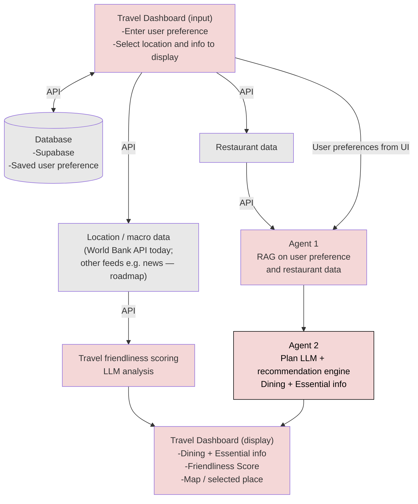
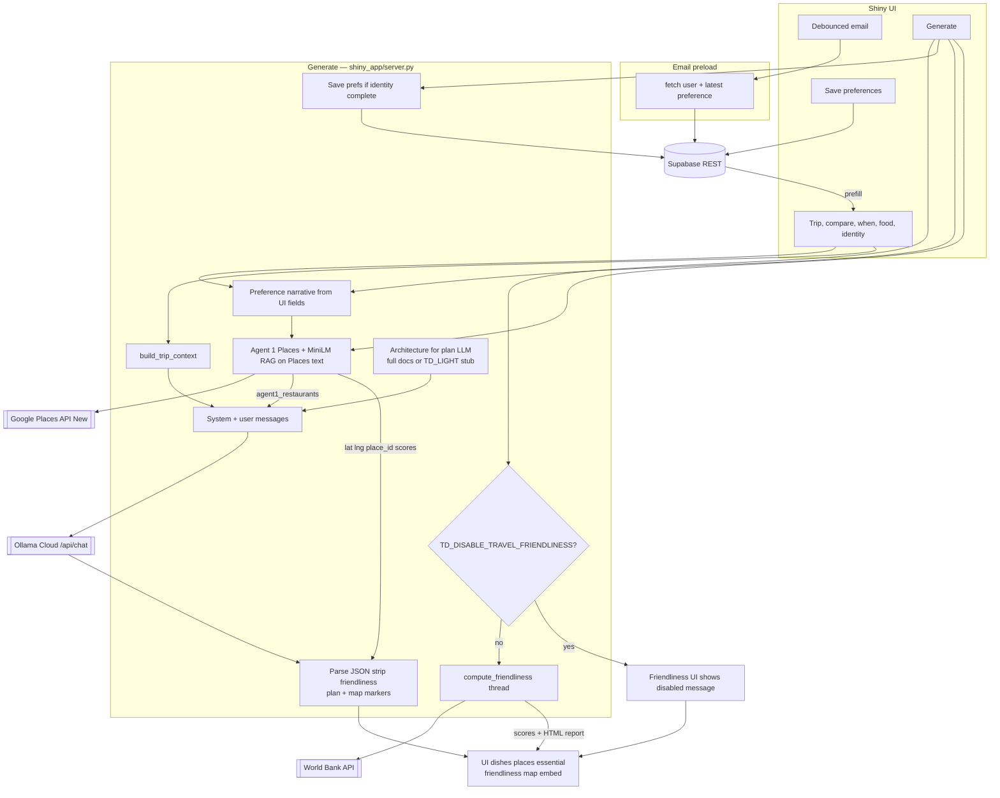

<!-- Generated by scripts/build_readme.py from README.template.md + docs/architecture.md -->

# Travel Dashboard

Web app for planning trips, capturing food preferences, and generating structured travel recommendations in one UI. This README includes **app description**, **process diagrams**, and **technical documentation** for developers and stakeholders.

## Table of contents

- [Repository](#repository)
- [App description and documentation](#app-description-and-documentation)
  - [Description](#description)
  - [Usage instructions (deployed app)](#usage-instructions-deployed-app)
  - [Process diagram and architecture reference](#process-diagram-and-architecture-reference)
    - [Target pipeline (multi-agent, review RAG)](#target-pipeline-multi-agent-review-rag)
    - [Legend (target pipeline)](#legend-target-pipeline)
    - [Current implementation (Shiny prototype — data flow)](#current-implementation-shiny-prototype--data-flow)
  - [Technical documentation](#technical-documentation)
    - [System architecture (roles and workflow)](#system-architecture-roles-and-workflow)
    - [RAG and tool implementation](#rag-and-tool-implementation)
    - [Travel advisory](#travel-advisory)
    - [Technical details](#technical-details)
    - [LLM model usage](#llm-model-usage)
    - [Google Cloud: Places and Maps Embed setup](#google-cloud-places-and-maps-embed-setup)
    - [Usage instructions (local development)](#usage-instructions-local-development)
- [Stack](#stack)
- [Supabase](#supabase)
  - [Schema](#schema)
    - [`app_user`](#app_user)
    - [`preference`](#preference)
    - [UI ↔ database mapping (Save)](#ui--database-mapping-save)
  - [Apply migrations](#apply-migrations)
- [Layout](#layout)
- [Appendix: README maintenance](#appendix-readme-maintenance)

<p align="center">
  
</p>

| | Purple | Pink | Soft | Yellow | Cyan |
| :-- | :--: | :--: | :--: | :--: | :--: |
| **Hex** | `#AC85E9` | `#FF6C9D` | `#FFA3C8` | `#FDE164` | `#01E1F2` |

These colors match the Shiny UI (`shiny_app/www/custom.css`) and documentation visuals.

## Repository

Source of truth on GitHub: [https://github.com/JanHsuanChu/TravelDashboard](https://github.com/JanHsuanChu/TravelDashboard)

Clone:

```bash
git clone https://github.com/JanHsuanChu/TravelDashboard.git
cd TravelDashboard
```

If you already have this folder inside another workspace, push from here:

```bash
cd TravelDashboard
git remote -v   # should show origin -> JanHsuanChu/TravelDashboard
git push -u origin main
```

(Create an empty repo on GitHub first if it does not exist yet, then push.)

## App description and documentation

### Description

**What it does:** The Travel Dashboard is a **Shiny for Python** browser app where users enter a destination, optional compare locations, season or month, and detailed **food preferences** (preset tags plus short free text, including **dietary restrictions** that the model must honor). Users can **save** preferences to the database and **generate** a structured plan:

- **Dining — dishes** — LLM-suggested dishes with a **price tier** badge only: **`$`**, **`$$`**, or **`$$$`** (budget / mid-range / upscale–style; inferred, not live menu prices).
- **Dining — recommended places** — When **Google Places** is configured, the app runs **Agent 1**: real restaurants from **Text Search**, ranked with **embedding similarity** (sentence-transformers) to the user’s preferences, then **Agent 2** (Ollama) writes place notes using that list. Each place shows **retrieval match %** (from RAG scores) and **Google price level** as **`$` / `$$` / `$$$`** when the API returns it. A **Google Map** (Embed API) shows the selected venue.
- **Essential info** — **Travel advisory** uses live U.S. State Department table data plus a short **auxiliary-model** summary; **weather** still comes from the **Agent 2** plan JSON (illustrative unless you add a live feed).
- **Travel friendliness** — **World Bank**–based scores and HTML report shell in [`shiny_app/travel_friendliness/`](shiny_app/travel_friendliness/); numeric scores are **not** from the LLM. Optional **auxiliary-model** prose fills report Purpose/Recommendations when enabled.

Without a Places API key, dining places are generic LLM suggestions and the map stays empty; dishes and friendliness still work.

### Usage instructions (deployed app)

**App link (Posit Connect Cloud):** `https://connect.systems-apps.com/TravelDashboard/`

**Password:** None (Connect access control, if any, is handled by the platform).

**How to use:**

- **Enter destination**: choose **Country** (required) and optional **City/region**.
- **Set timing**: choose **Season** or **Month** (one mode).
- **Food preferences**: pick tags and optionally add free-text likes/dislikes/restrictions.
- **Optional: Save food preferences**: fill **First name** + **Email** to save and enable preload on future visits.
- **Generate recommendations**: updates **Dining — dishes**, **Dining — recommended places** (and map if Google is configured), **Essential info**, and **Travel friendliness**.

**Preference UX (brief):** The app has **no accounts**. Your **email is an optional identity** used to **load your most recent saved food preferences** when you return. **Generate** still works without name/email; when both are valid, **Generate may auto-save a new preference snapshot** first. Full UX spec: [`docs/ui_flow_preferences.md`](docs/ui_flow_preferences.md).

**Travel friendliness (brief):** Scores come from the **World Bank API** (normalized to **0–100** with fixed reference bounds). The card’s summary line is deterministic (no LLM). If `OLLAMA_API_KEY` is set, the downloadable HTML report may include optional model-written **Purpose** and **Recommendations**. Details: [`docs/travel_friendliness.md`](docs/travel_friendliness.md).

**APIs in use:**

| API / service | Purpose |
|----------------|---------|
| **Supabase** (PostgREST via `supabase-py`) | Persist `app_user` and `preference` rows; resolve returning users and load latest preferences by email. |
| **Ollama Cloud** (`POST …/api/chat`) | **Agent 2** model: plan JSON (dining + essential scaffold). **Auxiliary** model: U.S. advisory blurb + optional friendliness report prose. See [LLM model usage](#llm-model-usage). |
| **World Bank API** (`api.worldbank.org/v2`) | Travel friendliness scoring and detailed HTML report (see [`docs/travel_friendliness.md`](docs/travel_friendliness.md)). |
| **Google Places API (New)** | Server-side **Text Search** and **Place Details** for restaurant retrieval (`places.googleapis.com`). |
| **Google Maps Embed API** | In-browser embedded map for the selected recommended place (same API key as Places in this app). |
| **sentence-transformers** (local, PyTorch) | Embedding model **all-MiniLM-L6-v2** for Agent 1 ranking over place name, address, types, editorial summary (downloaded on first use). |

**Features and how they add value:**

| Capability | Status | Value |
|------------|--------|--------|
| **Preference storage** | Implemented | Returning users don’t need to re-enter preferences: the app preloads the most recent saved food tags + text by email. |
| **Plan generation (Agent 2)** | Implemented | One Ollama Cloud call generates a structured plan JSON for **Dining** + **Essential info**; optionally grounded by the Agent 1 restaurant candidate list. |
| **Essential info — travel advisory** | Implemented | Live U.S. State Dept advisory table + cached snapshot + short auxiliary-model blurb (grounded in the matched row). |
| **Travel friendliness scoring module** | Implemented | Deterministic World Bank–based scores + downloadable HTML report; optional auxiliary-model prose for the report. |
| **Agent 1 — Places + embedding RAG** | Implemented (optional) | Live restaurant candidates, semantic ranking, preference-aware search queries; details include `priceLevel` and review snippets for the LLM. |
| **Agent 2 — Dining copy** | Implemented | Structured dishes (`$`/`$$`/`$$$`) and places aligned to Agent 1 names when available. |
| **Full multi-agent orchestration** | Partial / evolving | Two-stage dining pipeline today; broader tool calling and review corpora remain roadmap (see target diagram). |

**Stakeholders:** **Travelers** get a single place for preferences and AI-assisted suggestions; **developers** get a small, inspectable stack (Shiny + Supabase + **Ollama Cloud** with **separate default models** for plan vs auxiliary calls) that can grow toward the multi-agent design in `docs/architecture.md`.

**Preference UX (identity, returning users, Save vs Generate):** see [`docs/ui_flow_preferences.md`](docs/ui_flow_preferences.md).

### Process diagram and architecture reference

The content below is **generated** from [`docs/architecture.md`](docs/architecture.md). It includes the **target** pipeline (agents, RAG, tools) and a **current** Shiny data-flow diagram. Edit that file, then run `python3 scripts/build_readme.py` to refresh `README.md`. CI also regenerates `README.md` when `docs/architecture.md` or `README.template.md` changes.

The **first** diagram is the **target** pipeline (multi-agent; **Agent 1** retrieval; **Agent 2** plan LLM for **Dining** and **Essential info**; travel friendliness scoring module). The **second** diagram is the **current** Shiny app data flow (Supabase for persistence and form preload, optional Google Places + embedding RAG, Ollama, injected architecture context).

#### Target pipeline (multi-agent, review RAG)

This is the roadmap: specialized agents; **Agent 1** runs **RAG on user preference and restaurant data** (preferences from the **Travel Dashboard**—including values persisted in **Supabase** and shown in the UI—plus external **restaurant data**); **Agent 2** is the **plan LLM** and recommendation engine for **Dining** and **Essential info**; a seperate LLM-powered workflow covers travel friendliness and the report path to the dashboard.



#### Legend (target pipeline)

| Area | Role |
|------|------|
| **Travel Dashboard (input)** | User preferences, location selection, display choices, and questions—**fed into Agent 1** together with **restaurant data** for RAG. |
| **Supabase** | **Saved user preferences** (Save / returning users); supports the dashboard and **Agent 1** preference signal alongside **restaurant data**. |
| **Restaurant data** | External corpus/API for **Agent 1 RAG** (listings, details, public text). **Shiny:** **Google Places API (New)** Text Search + Place Details + local embedding rank (`restaurant_rag.py`). |
| **Location / macro data** | **World Bank** API → travel friendliness scoring module in the **current** Shiny app (`travel_friendliness/wb_api.py`). Extra feeds (e.g. news, monitors) remain **roadmap** for the target diagram only. |
| **Agent 1 → Agent 2** | Retrieval (**user preference** + **restaurant data**) **→ Agent 2**, the **plan LLM** and recommendation engine that produces **Dining** (e.g. dishes + places) and **Essential info** (e.g. advisory / weather in the structured plan). |
| **Travel friendliness scoring module** | Travel friendliness scoring and report path **→ dashboard display** (Shiny: `travel_friendliness/`—World Bank data, HTML report, optional LLM prose). |
| **Travel Dashboard (display)** | **Dining** and **Essential info** from the **Agent 2** plan LLM; **friendliness** (and downloadable HTML report) from the travel friendliness scoring module; map / place selection via **Google Places + Maps Embed** (same API key) in Shiny. |

#### Current implementation (Shiny prototype — data flow)

**Entrypoint** (`shiny_app/app.py`): wires `ui` + `server`; starts a **daemon thread** to call `restaurant_rag.warm_embedding_model()` so **sentence-transformers** (`all-MiniLM-L6-v2`) can load before the first **Generate**.

**Outside Generate**

- **Debounced email** (`shiny_app/server.py`): valid email → Supabase `fetch_user_and_latest_preference` → prefill name, food textareas, and tag checkboxes; optional “welcome back” notification.
- **Save food preferences**: validate identity + food text → `get_or_create_user` + `insert_preference` (`shiny_app/supabase_client.py`).

**On Generate** (same handler; order below is logical; **travel friendliness runs in a background thread** in parallel with Supabase save, Agent 1, and Ollama until both sides finish)

1. **Travel friendliness** (unless `TD_DISABLE_TRAVEL_FRIENDLINESS` is set) — `shiny_app/travel_friendliness/pipeline.py`: World Bank indicators, deterministic scoring, HTML report. Optional **second** Ollama call for report **Purpose** / **Recommendations** prose is skipped when `TD_FRIENDLINESS_SKIP_REPORT_LLM` is set (scores and report shell still run). UI scores and download **do not** use any friendliness fields from the plan JSON.
2. **Optional auto-save** — If first name + valid email are present, preferences are persisted before planning (same path as **Save**).
3. **Preference narrative for Agent 1** — Built from **food and trip fields in the UI** at Generate time. If first name + email are present, the server may **append** text from the latest **Supabase** preference row (`preference_narrative_from_supabase_row`) after the trip narrative—still **plain text conditioning** for Places search / embeddings, not vector RAG over Supabase.
4. **Agent 1** (optional, when `GOOGLE_PLACES_API_KEY` is set) — `shiny_app/restaurant_rag.py` + `shiny_app/google_places_client.py`: **Places API (New)** Text Search (including a food-hint query), **embedding similarity** ranking, Place Details (address, review snippets, **price level**, coordinates). Candidates carry `rag_match_score` and `price_tier` for the UI.
5. **Agent 2** (plan LLM — **Dining** + **Essential info**) — One **Ollama Cloud** `POST …/api/chat` via `shiny_app/ollama_client.py`: `OLLAMA_MODEL`, `OLLAMA_HOST`, optional `OLLAMA_NUM_PREDICT`. System message = architecture context + JSON rules from `shiny_app/plan_logic.py`. If `TD_LIGHT_ARCH_CONTEXT` is set, a **short stub** is used instead of reading full `docs/architecture.md` via `shiny_app/context.py`. User message = `trip_and_food` + optional **`agent1_restaurants`**. Returned JSON includes **`dining`** and **`essential`** (advisory / weather); **`friendliness`** is **dropped** before storage—the UI uses the travel friendliness scoring module (World Bank) for that panel.
6. **Maps Embed API** — Selected place from merged LLM rows + Agent 1 markers → iframe URL (`shiny_app/server.py`); same key as Places.



**Footnotes:** `shiny_app/validators.py` validates food text, when-mode, and email shape. UI layout lives in `shiny_app/ui.py` and `shiny_app/components/`. **Target:** Agent 1 **RAG on user preference and restaurant data**. **Current** Shiny prototype: retrieval over **Google Places** text + embeddings, with preference narrative from the **UI** (and optional merged saved text); Places and friendliness calls are **server-orchestrated** (no model-invoked tool API in the LLM sense).


### Technical documentation

#### System architecture (roles and workflow)

| Piece | Responsibility |
|-------|------------------|
| **UI** ([`shiny_app/ui.py`](shiny_app/ui.py), [`shiny_app/components/`](shiny_app/components/)) | Plan form, outputs grid (dishes, essential, friendliness), full-width dining places + map. |
| **Server** ([`shiny_app/server.py`](shiny_app/server.py)) | **Save** → Supabase user + preference; debounced-email preload; **Generate** → optional `TD_DISABLE_TRAVEL_FRIENDLINESS`, friendliness thread + optional save + Agent 1 + Ollama, strip `friendliness` from plan JSON, map markers and embed URL. |
| **`validators`** ([`shiny_app/validators.py`](shiny_app/validators.py)) | Food text, when-mode (season/month), and email shape checks for Save / Generate. |
| **`plan_logic`** ([`shiny_app/plan_logic.py`](shiny_app/plan_logic.py)) | `build_trip_context`, user/system JSON instructions (dietary rules, dish `$`/`$$`/`$$$`, place alignment to Agent 1). |
| **`restaurant_rag`** ([`shiny_app/restaurant_rag.py`](shiny_app/restaurant_rag.py)) | Preference narrative → Places search (generic + food-hint query), embed query and place blurbs, cosine rank, Place Details, `price_tier` + `rag_match_score` on candidates. |
| **`google_places_client`** ([`shiny_app/google_places_client.py`](shiny_app/google_places_client.py)) | Places API (New): `searchText`, GET Place Details, field masks. |
| **`context`** ([`shiny_app/context.py`](shiny_app/context.py)) | Reads repo-root [`docs/architecture.md`](docs/architecture.md) for the plan LLM when the server uses full architecture context (bypassed when `TD_LIGHT_ARCH_CONTEXT` supplies a short stub). |
| **`supabase_client`** ([`shiny_app/supabase_client.py`](shiny_app/supabase_client.py)) | Supabase client, users, preferences. |
| **`ollama_client`** ([`shiny_app/ollama_client.py`](shiny_app/ollama_client.py)) | Ollama Cloud chat + JSON extraction. |
| **`travel_friendliness`** ([`shiny_app/travel_friendliness/`](shiny_app/travel_friendliness/)) | World Bank fetch, scoring, HTML report. |

**Workflow (high level):** On **Generate**, **travel friendliness** is submitted on a **background thread** (unless `TD_DISABLE_TRAVEL_FRIENDLINESS`) while the server may auto-save prefs, run **Agent 1** (if `GOOGLE_PLACES_API_KEY`), and call **Ollama** for the plan JSON. The handler waits for both the LLM response and the friendliness future before updating the UI. If the Places key is set, **Agent 2** receives `agent1_restaurants`. The UI merges place rows with coordinates, shows **% match · $tier** when available, and embeds the map. System context is **full `docs/architecture.md`** or a **short stub** when `TD_LIGHT_ARCH_CONTEXT` is set.

#### RAG and tool implementation

| Topic | Implementation today | Roadmap (aligned with target diagram) |
|-------|----------------------|----------------------------------------|
| **RAG (restaurants)** | **Embedding retrieval** over **Places Text Search** results (name, address, types, editorial summary, rating line). Review text is **not** embedded for ranking; snippets are passed to the LLM after ranking. Optional **keyword overlap** boost from “food I like” tokens. | Richer signals (menus if licensed), multi-query fusion, optional re-rank with reviews. |
| **Architecture “RAG”** | Full [`docs/architecture.md`](docs/architecture.md) via [`shiny_app/context.py`](shiny_app/context.py), **or** a short in-code stub when `TD_LIGHT_ARCH_CONTEXT` is set ([`shiny_app/server.py`](shiny_app/server.py)). | Same. |
| **Tool calling** | **No** LLM-invoked tools; Places and World Bank are **server-orchestrated** HTTP calls. | Model-driven tool use if product needs it. |

If you add tools later, document **name**, **purpose**, **parameters**, and **return shape** here and in code docstrings.

#### Travel advisory

On **Generate**, the server pulls the U.S. State Department’s **public** travel advisory listing (the official page embeds the table; a legacy JSON URL may redirect to HTML, which the client parses). Results are **cached** for about **24 hours** by default (`TD_US_ADVISORY_CACHE_SECONDS`); if a refresh fails, the app can still use the **last successful snapshot** so the run does not hard-fail on transient network or HTML changes.

The **destination country** you pick is matched to a row using **ISO2** plus name **aliases** from [`shiny_app/www/data/countries_slim.json`](shiny_app/www/data/countries_slim.json) (with fuzzy name fallback when needed). The matched advisory level and official text feed **Essential → Travel advisory** as markdown.

A small **auxiliary** Ollama call (same **OTHER** tier as friendliness prose; see [LLM model usage](#llm-model-usage)) adds a **brief plain-language summary** (grounded in the matched row, not a substitute for the official advisory). Wiring lives in [`shiny_app/server.py`](shiny_app/server.py); fetch, cache, parse, and match logic are in [`shiny_app/us_travel_advisory.py`](shiny_app/us_travel_advisory.py).

#### Technical details

**Environment variables** (set in [`shiny_app/.env`](shiny_app/.env); copy from [`shiny_app/.env.example`](shiny_app/.env.example)):

| Variable | Required | Purpose |
|----------|----------|---------|
| `SUPABASE_URL` | Yes (save / load) | Supabase project URL. |
| `SUPABASE_KEY` | Yes (save / load) | JWT-style API key (`eyJ…`) for `app_user` / `preference` (see `.env.example` for legacy key note). |
| `OLLAMA_API_KEY` | Yes (**Generate**) | Bearer token for Ollama Cloud. |
| `OLLAMA_HOST` | No | API host only (default `https://ollama.com`); the client posts to `{host}/api/chat`. |
| `OLLAMA_MODEL_AGENT2` | No | Model for **Agent 2** (main Generate JSON). Default `nemotron-3-nano:30b-cloud`. |
| `OLLAMA_MODEL_OTHER` | No | Auxiliary calls (advisory blurb, friendliness report prose). Default `gpt-oss:20b-cloud`. Alias: `OLLAMA_MODEL_AUXILIARY`. |
| `OLLAMA_MODEL_AGENTS` | No | Optional: one value for both agent tiers when `OLLAMA_MODEL_AGENT2` unset. |
| `OLLAMA_MODEL_AGENT1` | No | Reserved (Agent 1 is Places+embeddings only). |
| `OLLAMA_MODEL` | No | Fallback for **OTHER** tier only (not Agent 2). |
| `OLLAMA_NUM_PREDICT` | No | Optional cap on completion tokens for the **main** plan call (`ollama_client`). |
| `TD_DISABLE_TRAVEL_FRIENDLINESS` | No | When truthy, skips the World Bank friendliness thread during **Generate** (UI shows a disabled message; dining still runs). |
| `TD_FRIENDLINESS_SKIP_REPORT_LLM` | No | When truthy, keeps World Bank scores and HTML report shell but skips the **extra** Ollama call for report Purpose/Recommendations prose. |
| `TD_LIGHT_ARCH_CONTEXT` | No | When truthy, uses a short system stub instead of loading full `docs/architecture.md` for the plan model. |
| `GOOGLE_PLACES_API_KEY` | No† | Agent 1 restaurant retrieval, Google **price level** on places, **RAG % match** from retrieval scores, and **Maps Embed** iframe. |

†**Why “No”?** The Shiny app **starts** and **Generate** still works without this key: you get LLM-written **dishes**, **essential** text, and **travel friendliness** (World Bank). You do **not** get real venue lookup, the **embedded map**, or server-backed **% match · $** on recommended places—those need `GOOGLE_PLACES_API_KEY`. Treat it as **required** if you want the full dining + map experience described in this README.

#### LLM model usage

Ollama is invoked from a **shared host** (`OLLAMA_HOST`, default `https://ollama.com`) with **model names chosen by tier** in [`shiny_app/ollama_client.py`](shiny_app/ollama_client.py).

| Tier | Default model | Where it runs | What it does |
|------|----------------|-----------------|---------------|
| **Agent 2** | `nemotron-3-nano:30b-cloud` | [`server.py`](shiny_app/server.py) on **Generate** | One `ollama_chat` call returns the **plan JSON** (`dining`, `essential` weather scaffolding, etc.). `friendliness` in that JSON is discarded; scores come from World Bank. |
| **Auxiliary (“OTHER”)** | `gpt-oss:20b-cloud` | [`us_travel_advisory.py`](shiny_app/us_travel_advisory.py), [`travel_friendliness/pipeline.py`](shiny_app/travel_friendliness/pipeline.py) | (1) **U.S. travel advisory** — after the State Dept row is matched, a short plain-text summary (separate `ollama_chat` with a small `num_predict` cap). (2) **Friendliness HTML report** — optional **Purpose** / **Recommendations** paragraphs; skipped when `TD_FRIENDLINESS_SKIP_REPORT_LLM` is set or when `OLLAMA_API_KEY` is missing. |

**Agent 1** (restaurant retrieval) uses **Google Places** + **sentence-transformers** embeddings only — **no** Ollama. `OLLAMA_MODEL_AGENT1` and `resolved_model_agent1()` are reserved for a future Agent 1 LLM step.

**How env vars map to tiers**

- **Agent 2:** `OLLAMA_MODEL_AGENT2` → else `OLLAMA_MODEL_AGENTS` → else default `nemotron-3-nano:30b-cloud`. **`OLLAMA_MODEL` does not apply** to Agent 2 (so plan and auxiliary defaults stay independent).
- **Auxiliary:** `OLLAMA_MODEL_OTHER` or `OLLAMA_MODEL_AUXILIARY` → else `OLLAMA_MODEL` → else default `gpt-oss:20b-cloud`.
- **Agent 1 (reserved):** `OLLAMA_MODEL_AGENT1` → else same chain as Agent 2 when a call site uses `resolved_model_agent1()`.

**`OLLAMA_NUM_PREDICT`:** When set, it is applied to `ollama_chat` requests that do not pass an explicit `num_predict` (the main plan call; advisory summary uses its own cap in code).

**Endpoints (app as client):**

- Supabase: project REST URL (used by `supabase-py`).
- Ollama Cloud: `{OLLAMA_HOST or https://ollama.com}/api/chat` — [`shiny_app/ollama_client.py`](shiny_app/ollama_client.py).
- Google: `https://places.googleapis.com/v1/places:searchText`, Place Details, and `https://www.google.com/maps/embed/v1/place` — [`shiny_app/google_places_client.py`](shiny_app/google_places_client.py).

#### Google Cloud: Places and Maps Embed setup

Use **one Google Cloud project** and **one API key** for both server-side Places calls and the browser-loaded Embed map (as configured in this repo).

1. **Create or select a project** in [Google Cloud Console](https://console.cloud.google.com/) and ensure **billing** is enabled for that project.

2. **Enable APIs** (APIs & Services → Library):
   - **Places API (New)** — required for `places.googleapis.com` Text Search and Place Details. Do not rely on only the legacy “Places API” name if your console lists them separately; the app targets the **New** Places endpoints.
   - **Maps Embed API** — required for the dining map iframe (`maps/embed/v1/place`).

3. **Create an API key** (APIs & Services → Credentials → Create credentials → API key).

4. **Restrict the key (recommended)**  
   - Under **API restrictions**, choose “Restrict key” and select at least **Places API (New)** and **Maps Embed API**.  
   - Under **Application restrictions**:  
     - **Server-side Places** requests come from your **Python process** (Shiny server), not from the user’s browser tab. **HTTP referrer (website) restrictions** often **break** those calls (`API_KEY_SERVICE_BLOCKED` or 403). For local development, **Application restrictions: None** is the simplest path while keeping **API restrictions** on the key.  
     - For production, common patterns are: **no application restriction** + tight API restrictions; **separate keys** for server (IP restriction) vs browser (HTTP referrers for your deployed Shiny origin); or a small backend proxy so only server-side code holds the Places key.  
   - If you use **HTTP referrers** for the same key as the Embed iframe, add origins such as `http://127.0.0.1:8000/*` and `http://localhost:8000/*` for local Shiny; the server may still need a referrer-safe or separate key for Places (see [`shiny_app/google_places_client.py`](shiny_app/google_places_client.py) error hints).

5. **Set the key in the app:** copy [`shiny_app/.env.example`](shiny_app/.env.example) to `shiny_app/.env` and set `GOOGLE_PLACES_API_KEY=<your key>`.

6. **First run with RAG:** `pip install -r requirements.txt` pulls `sentence-transformers` (and typically PyTorch). The embedding model downloads on first **Generate**; allow network access once.

**Packages:** see [`shiny_app/requirements.txt`](shiny_app/requirements.txt) — `shiny`, `supabase`, `requests`, `python-dotenv`, `pandas`, `markdown`, `sentence-transformers`, `numpy`.

**Repository layout:**

- **Shiny app:** [`shiny_app/`](shiny_app/) — `app.py` (entrypoint; background warm of `all-MiniLM-L6-v2`), `ui.py`, `server.py`, `plan_logic.py`, `restaurant_rag.py`, `google_places_client.py`, `context.py`, `validators.py`, `supabase_client.py`, `ollama_client.py`, `components/`, `www/custom.css`
- **SQL:** [`supabase/migrations/`](supabase/migrations/)
- **Docs / prompt context:** [`docs/architecture.md`](docs/architecture.md)

**Deployment:** This app is deployed on **Posit Connect Cloud** at `https://connect.systems-apps.com/TravelDashboard/`. The documented path below is **local** (`shiny run app.py`). You can host on **Posit Connect**, **Shiny Server**, or a **container**; configure the same environment variables on the host. There is **no app-level password** in this prototype—use platform auth, VPN, or network rules if you expose it beyond localhost.

#### Usage instructions (local development)

1. **Environment:** Python 3.10+ recommended. From the repo root:

```bash
cd shiny_app
python3 -m venv .venv
source .venv/bin/activate   # Windows: .venv\Scripts\activate
pip install -r requirements.txt
cp .env.example .env        # set SUPABASE_*, OLLAMA_*; optional GOOGLE_PLACES_API_KEY
```

2. **Run:**

```bash
shiny run app.py --reload
```

Or from repo root (after venv is ready): `./run_shiny.sh`

3. **Open** the URL Shiny prints (commonly `http://127.0.0.1:8000`).

4. **Use the UI:** Enter **destination** (country required), optional **compare** cities, **when** (season or month), **food** tags and text (including **dietary** checkboxes and restrictions). **Save food preferences** requires first name + email. **Generate recommendations** refreshes **dishes**, **recommended places** (+ map when Google is configured), **essential** blurbs, and **travel friendliness**. A recognized **email** (debounced or on blur) preloads saved preferences.

**Password:** None for the default local app. If you deploy behind a platform that adds authentication, follow that platform’s login flow.

---

## Stack

- [Shiny for Python](https://shiny.posit.co/py/) — dashboard in [`shiny_app/`](shiny_app/)

## Supabase

**Example project URL (public):** `https://stnfxxjktzznvlfhczcz.supabase.co`  
**Project reference (for MCP):** `stnfxxjktzznvlfhczcz`

### Schema

#### `app_user`

| Column | Type | Constraints |
|--------|------|-------------|
| `user_id` | `UUID` | Primary key, default `gen_random_uuid()` |
| `first_name` | `TEXT` | not null |
| `email` | `TEXT` | not null, unique |
| `email_hash` | `TEXT` | not null, unique (SHA-256 hex of normalized email; see migration 004) |
| `created_at` | `TIMESTAMPTZ` | not null, default `now()` |

#### `preference`

| Column | Type | Constraints |
|--------|------|-------------|
| `preference_id` | `BIGINT` | Primary key, generated identity |
| `user_id` | `UUID` | not null, FK → `app_user(user_id)` (cascade on delete) |
| `created_at` | `TIMESTAMPTZ` | not null, default `now()` |
| `food_like_text` | `TEXT` | nullable (UI max 50 words) |
| `food_dislike_text` | `TEXT` | nullable (UI max 50 words) |
| `dietary_restrictions` | `TEXT` | nullable (UI max 50 words) |
| `food_tags` | `JSONB` | not null, default `{}` — preset checkbox slugs: `like` / `dislike` / `dietary` arrays |

Index: `idx_preference_user_created_at` on `(user_id, created_at DESC)`.

#### UI ↔ database mapping (Save)

Saving **food preferences** writes one `preference` row and ensures an `app_user` row. Trip fields (destination, compare, when) and **Generate** output are **not** persisted to these tables today.

| Supabase column / table | Shiny input(s) | Notes |
|-------------------------|----------------|--------|
| `app_user.first_name` | **First name** | Required on Save. |
| `app_user.email` | **Email** | Required on Save; used to find or create `app_user`. |
| `preference.food_like_text` | **Food I like** — detail textarea | Validated to max word count in UI. |
| `preference.food_dislike_text` | **Food I dislike** — detail textarea | Same. |
| `preference.dietary_restrictions` | **Dietary restrictions** — detail textarea | Same. |
| `preference.food_tags` | **Food I like / dislike / Dietary** checkbox groups | Stored as JSON: `{ "like": [...], "dislike": [...], "dietary": [...] }` (slug values from [`shiny_app/tags.py`](shiny_app/tags.py)). |

### Apply migrations

Run in order:

1. [`supabase/migrations/001_app_user_preference.sql`](supabase/migrations/001_app_user_preference.sql)
2. [`supabase/migrations/002_preference_food_text.sql`](supabase/migrations/002_preference_food_text.sql)
3. [`supabase/migrations/003_drop_dining_preference.sql`](supabase/migrations/003_drop_dining_preference.sql) — drops legacy unused `dining_preference` if present
4. [`supabase/migrations/004_app_user_email_hash.sql`](supabase/migrations/004_app_user_email_hash.sql) — adds `app_user.email_hash` (SHA-256 of normalized email) for stable identity

- **Option A: Supabase Dashboard (SQL Editor)**: paste each file and **Run**.
- **Option B: Supabase MCP**: `apply_migration` / `execute_sql` with the same SQL.

## Layout

## Appendix: README maintenance

The root `README.md` is generated from [`README.template.md`](README.template.md) and [`docs/architecture.md`](docs/architecture.md). After editing either, regenerate:

```bash
python3 scripts/build_readme.py
```

- **Shiny (Python):** [`shiny_app/`](shiny_app/) — `app.py`, `ui.py`, `server.py`, [`components/`](shiny_app/components/), [`www/custom.css`](shiny_app/www/custom.css)
- **SQL:** [`supabase/migrations/`](supabase/migrations/)
