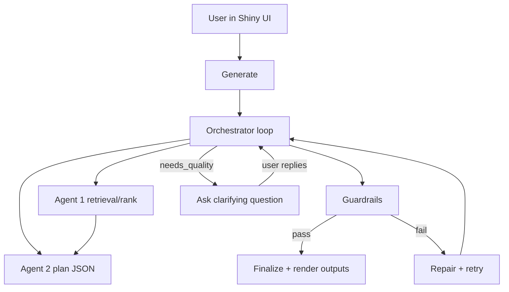

## TravelDashboard Agentic Loop UI (Final Design)

This document describes the **final intended UX and design** for the TravelDashboard agentic loop (chat + recommendations + status surface).

It is **additive**: it wraps the existing Agent 1 and Agent 2 without redesigning or replacing them.

## What “agentic loop” means here (and why this qualifies)

This qualifies as an **agentic loop** because:

- **Unknown/variable number of turns**: a request may complete immediately or require multiple refinement turns.
- **The system decides when to stop**: explicit stop conditions plus a hard turn budget.
- **Looping behavior**: propose → validate (guardrails) → repair/retry if needed → ask for refinement → rerank → finalize.
- **Bounded behavior**:
  - **User-facing turns** (assistant messages shown in chat): min **2**, max **6**
  - **Internal retries** (repair loops + deterministic reruns): max **6**

## Additive integration (Agent 1 and Agent 2 remain intact)

- **Agent 1 (unchanged responsibilities)**: deterministic restaurant retrieval + embedding ranking.
  - Code: `shiny_app/restaurant_rag.py`
  - Output: ranked candidate venues with metadata used for UI grounding and match scores.

- **Agent 2 (unchanged responsibilities)**: plan LLM that returns a **single JSON object** in the existing schema.
  - Code: `shiny_app/plan_logic.py` (prompt rules), `shiny_app/ollama_client.py` (call)

- **Orchestrator (agentic wrapper)**: calls Agent 1/2 as needed and applies validation + retries.
  - Code: `shiny_app/agent_loop.py`
  - UI wiring and state: `shiny_app/server.py`, `shiny_app/ui.py`

## UI structure (mockup-aligned, TravelDashboard theme)

### Floating widget open/close (Intercom-style)
- The chat UI is a **fixed-position floating widget** anchored to the **bottom-right** of the screen.
- A **Food guide** floating action button (FAB) toggles it open/closed.
- There is **no backdrop/overlay**; the dashboard remains usable behind the widget.

### Context bar (read-only)
A read-only context bar sits above the messages labeled **“From your form:”** and shows tags derived from the form:
- Location + timing
- Dietary restrictions (**checkbox + free-text**, decoded into chips)
- Likes/dislikes (**checkbox + free-text**, decoded into chips)

This communicates: “I already know this; you don’t need to repeat it.”

### Chat column (left)
- Conversation starts **after Generate recommendations**.
- The assistant opens with a tailored summary plus **3 starter places**.
- Recommendation cards reuse the existing “Dining — recommended places” card content (same name/badge/note/address presentation), embedded under the agent message.
- **Quick reply chips** appear after agent messages to reduce typing friction.
  - Chips are **LLM-generated** but validated server-side (count/length/no URLs).
  - Clicking a chip populates the message box.
- Free text remains available for anything outside chips.
- A **New location** action exists on the **main dashboard** (not inside the widget) and resets destination + chat state.

### Agent Status (collapsible drawer inside widget)
Agent Status is a user-visible “thinking surface” inside the widget:
- Collapsible **drawer** (open by default; users can hide/show)
- Guardrails active (blockers)
- Preference match summary
- Conversation state (turns used, session)

Status details:
- Guardrails show a traffic-light dot per rule (green when armed/passing).
- Preference items list match percentages (derived from Agent 1 similarity scores when available).
 - Debug/status text (if any) is kept at the bottom of the panel.

### QC Evidence widget (separate UI surface, same loop)
- The floating **QC Evidence** widget is rendered separately from the chat status drawer, but it shows the **same QC Agent metadata** produced during `run_orchestrator_loop` in `shiny_app/agent_loop.py`.
- It is a visibility/control surface only (show/hide card); it does **not** run an independent agent or separate orchestration path.
- Data source: QC metadata under `plan._meta` plus latency/turn metadata attached by the orchestrator and consumed by `shiny_app/server.py`.

## How it works (high level)

## Guardrails (hard blockers)

Guardrails are **blockers** and intentionally narrow:
- **Location**
- **Dietary restrictions** (checkbox + free-text)

Chat must **not** introduce additional hard guardrails beyond these two.

Validation runs on every suggestion. If a guardrail fails, the Orchestrator triggers a **repair + retry** loop within the internal retry budget.

- **Location guardrail (hard)**:
  - Dining places must be grounded in Agent 1’s candidates (which are retrieved for the destination).
  - Enforcement today:
    - **Subset check**: `dining.places[].title` must match a candidate `name` (robust matching; see below).
    - **Destination check**: the matched candidate `formatted_address` must contain the destination city (or at least the destination country). If this cannot be verified, treat it as a mismatch and block.
  - Additional safety:
    - Agent 1 candidates are **pre-filtered** to the destination before Agent 2 sees them (conservative; uncertain candidates are dropped).

#### Robust place grounding (repair instead of failing)
To avoid brittle failures from minor name drift (punctuation/case/Unicode), the Orchestrator applies a deterministic “snap-to-candidate” repair step before hard validation:
- If Agent 2 outputs a place title that does not match an Agent 1 candidate well enough, it is replaced with the next-best unused candidate title.
- Badge/note are aligned to the snapped candidate.

This keeps the true blockers as **location + dietary**, while ensuring the plan stays grounded to retrieved venues.

- **Dietary guardrail (hard)**:
  - Dietary tags + restrictions override generic likes.
  - Enforcement today:
    - The prompt already instructs Agent 2 to comply.
    - Server-side validation additionally applies a coarse token blacklist for vegetarian/vegan dish text.
  - If the system cannot verify compliance, treat it as **non-compliant** and block.

### Guardrail failures trigger repair (retry loop)

When a hard guardrail fails (dietary or location), the Orchestrator does **not** pass the result. Instead it:

- appends the failed draft back into the message history
- sends a “repair” instruction (e.g., remove/replace non-compliant dishes; only use in-destination places)
- retries within the same **LLM turn budget**

This is what makes the Orchestrator behave agentically in practice: it can detect failure and **iterate** until it passes or the cap is reached.

Files:
- Prompt rules: `shiny_app/plan_logic.py` (`SYSTEM_JSON_INSTRUCTION`)
- Validation: `shiny_app/agent_loop.py` (`validate_plan_guardrails`)

## Ask vs stop policy (quality conversation)

- The agent asks for refinement only to improve recommendation quality (not to add blockers).
- Stop/finalize for a generation run occurs when:
  - hard guardrails pass
  - Agent 2 reaches its bounded turn policy (minimum self-check + capped retries)
  - QC Agent loop either reaches both 5/5 scores or hits its max QC turns

For chat refinements after Generate:
- each send runs a fresh bounded orchestrator pass using the same destination guardrail
- assistant chat turns are capped at 6 in the UI
- destination changes from chat are blocked; users must change destination fields and Generate again

### Interactive chat behavior (after Send)
After the user sends a message, the assistant produces a short, non-redundant follow-up message (LLM-written). If the Orchestrator needs clarification, the question is shown as an **assistant chat bubble**.

## Supabase persistence (current behavior)

Current persistence used by the app:

1. **Identity + preference preload**: debounced email lookup loads latest saved profile (`app_user` + latest `preference` row).
2. **Save + Generate auto-save path**: when identity is complete, preferences are written append-only to `preference`.
3. **Durable chat deltas (limited cases)**: certain chat intents such as “avoid spicy” / “no raw fish” can append a new `preference` snapshot.

Notes:
- Agent-session/feedback/weights helper functions exist in `shiny_app/supabase_client.py`, but the current UI loop primarily relies on `app_user` and `preference`.
- QC loop evidence is persisted to local JSON files under `shiny_app/data/qc_logs/` via `agent_loop.py`.

## Inline preference learning (visible + trustworthy)

When the user types something durable in chat (e.g., “avoid spicy”, “no raw fish”), the agent may decide to persist it as a **delta preference** for future trips.

- **De-dup rule**: if the preference is already present in the form values or latest stored profile, it is not stored again.
- **Storage**: write an append-only new row to the existing `preference` table (latest row represents current profile).

## Preference match scores (soft signal)

The UI surfaces preference match as a soft signal (not a blocker):
- per-place match (Agent 1 similarity scores when available)
- overall match summary in the Agent Status panel (e.g., average top-3 match)

## Logs (watch the loop in action)

Console logging is always available; file logging is optional.

- **Enable file logging**:
  - Set `TD_LOG_FILE=logs/app.log`
  - Optionally `TD_LOG_LEVEL=DEBUG`

High-signal events emitted by the Orchestrator include:
- `loop_start`, `retrieve_attempt`, `candidates_summary`, `agent2_call`, `decision`, `loop_error`
Additional UI-facing events include:
- chip generation success/fallback
- follow-up message success/fallback

