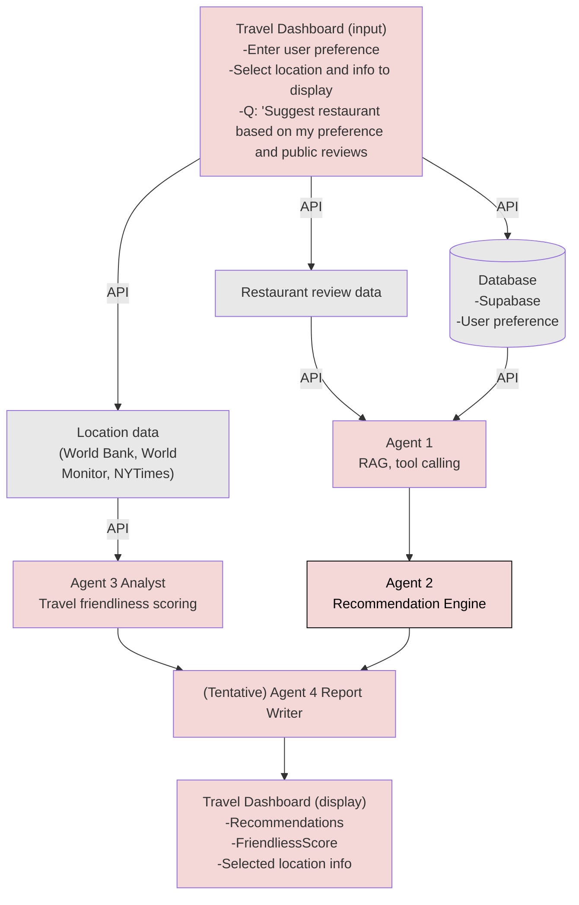

# Travel Dashboard — architecture (reference)

This diagram captures the intended data flow and agent pipeline. Use it when planning features, APIs, and UI surfaces.

## Legend (quick read)

| Area | Role |
|------|------|
| **Travel Dashboard (input)** | Preferences, location selection, display choices, natural-language questions (e.g. restaurant suggestions). |
| **Supabase** | Stores user preferences; feeds Agent 1. |
| **Restaurant review data** | External/API input to Agent 1 (RAG + tools). |
| **Location data** | World Bank, World Monitor, NYTimes, etc. → Agent 3 Analyst (friendliness scoring). |
| **Agent 1 → Agent 2** | RAG/tool calling → recommendation engine. |
| **Agent 3 → Agent 4** | Analyst → (tentative) report writer. |
| **Travel Dashboard (display)** | Recommendations, friendliness score, selected location info. |
