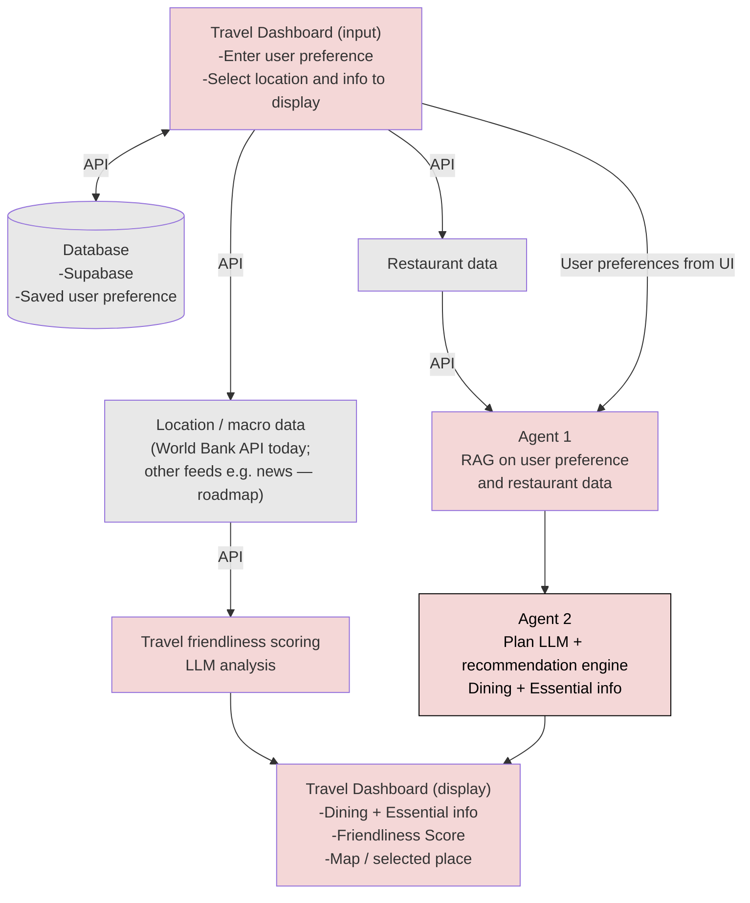
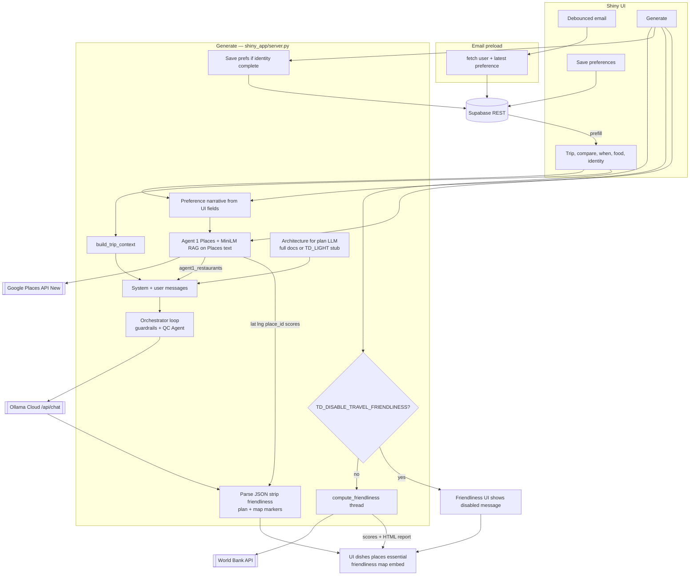

The **first** diagram is the **target** pipeline (multi-agent; **Agent 1** retrieval; **Agent 2** plan LLM for **Dining** and **Essential info**; travel friendliness scoring pipeline). The **second** diagram is the **current** Shiny app data flow (Supabase for persistence and form preload, optional Google Places + embedding RAG, Ollama, injected architecture context, and the orchestrator loop with guardrails/QC).

#### Target pipeline (multi-agent, review RAG)

This is the roadmap: specialized agents; **Agent 1** runs **RAG on user preference and restaurant data** (preferences from the **Travel Dashboard**—including values persisted in **Supabase** and shown in the UI—plus external **restaurant data**); **Agent 2** is the **plan LLM** and recommendation engine for **Dining** and **Essential info**; a friendliness scoring pipeline covers travel friendliness and the report path to the dashboard.

#### Legend (target pipeline)

| Area | Role |
|------|------|
| **Travel Dashboard (input)** | User preferences, location selection, display choices, and questions—**fed into Agent 1** together with **restaurant data** for RAG. |
| **Supabase** | **Saved user preferences** (Save / returning users); supports the dashboard and **Agent 1** preference signal alongside **restaurant data**. |
| **Restaurant data** | External corpus/API for **Agent 1 RAG** (listings, details, public text). **Shiny:** **Google Places API (New)** Text Search + Place Details + local embedding rank (`restaurant_rag.py`). |
| **Location / macro data** | **World Bank** API → friendliness pipeline in the **current** Shiny app (`travel_friendliness/wb_api.py`). Extra feeds (e.g. news, monitors) remain **roadmap** for the target diagram only. |
| **Agent 1 → Agent 2** | Retrieval (**user preference** + **restaurant data**) **→ Agent 2**, the **plan LLM** and recommendation engine that produces **Dining** (e.g. dishes + places) and **Essential info** (e.g. advisory / weather in the structured plan). |
| **Friendliness pipeline** | Travel friendliness scoring and report path **→ dashboard display** (Shiny: `travel_friendliness/`—World Bank data, HTML report, optional LLM prose). |
| **Travel Dashboard (display)** | **Dining** and **Essential info** from the **Agent 2** plan LLM; **friendliness** (and downloadable HTML report) from the friendliness pipeline; map / place selection via **Google Places + Maps Embed** (same API key) in Shiny. |

#### Current implementation (Shiny prototype — data flow)

**Entrypoint** (`shiny_app/app.py`): wires `ui` + `server`; starts a **daemon thread** to call `restaurant_rag.warm_embedding_model()` so **sentence-transformers** (`all-MiniLM-L6-v2`) can load before the first **Generate**.

**Outside Generate**

- **Debounced email** (`shiny_app/server.py`): valid email → Supabase `fetch_user_and_latest_preference` → prefill name, food textareas, and tag checkboxes; optional “welcome back” notification.
- **Save food preferences**: validate identity + food text → `get_or_create_user` + `insert_preference` (`shiny_app/supabase_client.py`).

**On Generate** (same handler; order below is logical; **travel friendliness runs in a background thread** in parallel with Supabase save, Agent 1, and Ollama until both sides finish)

1. **Travel friendliness** (unless `TD_DISABLE_TRAVEL_FRIENDLINESS` is set) — `shiny_app/travel_friendliness/pipeline.py`: World Bank indicators, deterministic scoring, HTML report. Optional **second** Ollama call for report **Purpose** / **Recommendations** prose is skipped when `TD_FRIENDLINESS_SKIP_REPORT_LLM` is set (scores and report shell still run). UI scores and download **do not** use any friendliness fields from the plan JSON.
2. **Optional auto-save** — If first name + valid email are present, preferences are persisted before planning (same path as **Save**).
3. **Preference narrative for Agent 1** — Built from **food and trip fields in the UI** at Generate time. If first name + email are present, the server may **append** text from the latest **Supabase** preference row (`preference_narrative_from_supabase_row`) after the trip narrative—still **plain text conditioning** for Places search / embeddings, not vector RAG over Supabase.
4. **Agent 1** (optional, when `GOOGLE_PLACES_API_KEY` is set) — `shiny_app/restaurant_rag.py` + `shiny_app/google_places_client.py`: **Places API (New)** Text Search (including a food-hint query), **embedding similarity** ranking, Place Details (address, review snippets, **price level**, coordinates). Candidates carry `rag_match_score` and `price_tier` for the UI.
5. **Orchestrator loop + Agent 2** — `shiny_app/agent_loop.py` coordinates retrieval grounding, Agent 2 calls, hard guardrail checks/repairs, and QC Agent turns (bounded). Agent 2 calls still run through **Ollama Cloud** via `shiny_app/ollama_client.py` with architecture context + JSON rules from `shiny_app/plan_logic.py`; `TD_LIGHT_ARCH_CONTEXT` can swap full architecture markdown for a short stub. Returned JSON drives `dining` and `essential`; `friendliness` JSON from the model is removed because the UI uses the World Bank friendliness pipeline.
6. **Maps Embed API** — Selected place from merged LLM rows + Agent 1 markers → iframe URL (`shiny_app/server.py`); same key as Places.

**Footnotes:** `shiny_app/validators.py` validates food text, when-mode, and email shape. UI layout lives in `shiny_app/ui.py` and `shiny_app/components/`. **Target:** Agent 1 **RAG on user preference and restaurant data**. **Current** Shiny prototype: retrieval over **Google Places** text + embeddings, with preference narrative from the **UI** (and optional merged saved text); Places and friendliness calls are **server-orchestrated** (no model-invoked tool API in the LLM sense).
