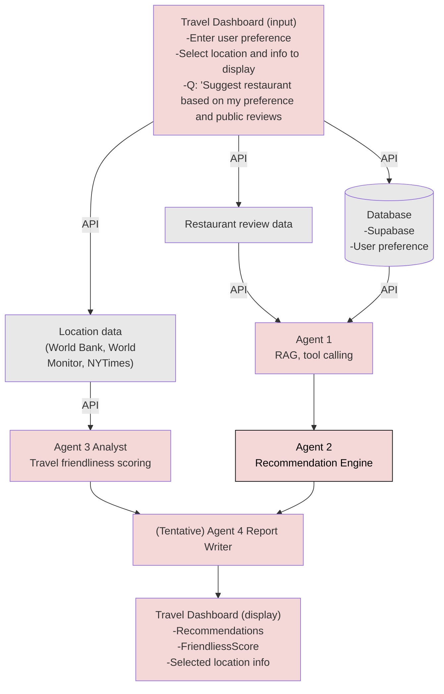
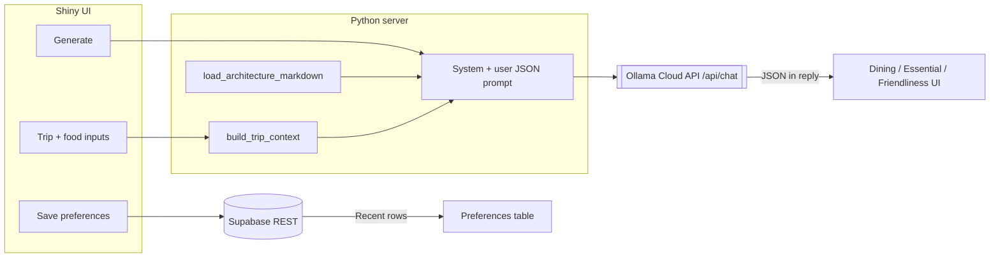

The **first** diagram is the **target** pipeline (multi-agent orchestration, RAG, external tools). The **second** diagram is the **current** Shiny prototype (single LLM call, Supabase, injected architecture context).

#### Target pipeline (agentic orchestration, RAG, tool calling)

This is the roadmap: specialized agents, retrieval from reviews and location APIs, and a report path to the dashboard UI.

#### Legend (target pipeline)

| Area | Role |
|------|------|
| **Travel Dashboard (input)** | Preferences, location selection, display choices, natural-language questions (e.g. restaurant suggestions). |
| **Supabase** | Stores user preferences; feeds Agent 1. |
| **Restaurant review data** | External/API input to Agent 1 (RAG + tools). |
| **Location data** | World Bank, World Monitor, NYTimes, etc. → Agent 3 Analyst (friendliness scoring). |
| **Agent 1 → Agent 2** | RAG/tool calling → recommendation engine. |
| **Agent 3 → Agent 4** | Analyst → (tentative) report writer. |
| **Travel Dashboard (display)** | Recommendations, friendliness score, selected location info. |

#### Current implementation (Shiny prototype — data flow)

What runs today: one **Ollama Cloud** chat completion per **Generate** click; **no** separate agent processes, **no** vector RAG index. `docs/architecture.md` is loaded **in full** as static system context (prompt injection), not retrieved by similarity search.

