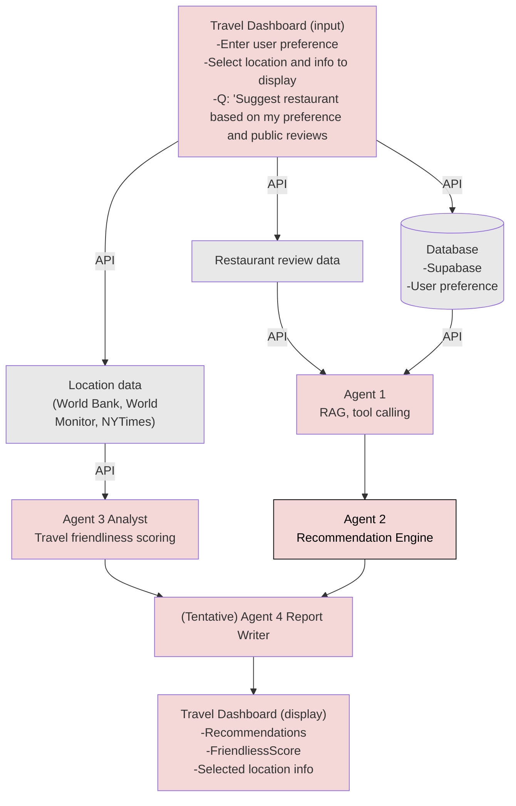
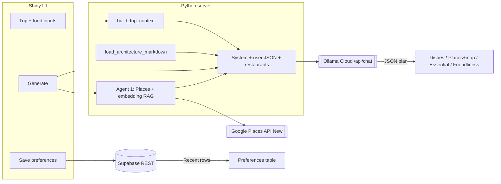

The **first** diagram is the **target** pipeline (multi-agent orchestration, RAG, external tools). The **second** diagram is the **current** Shiny app data flow (Supabase, optional Google Places + embedding RAG, Ollama, injected architecture context).

#### Target pipeline (agentic orchestration, RAG, tool calling)

This is the roadmap: specialized agents, retrieval from reviews and location APIs, and a report path to the dashboard UI.

#### Legend (target pipeline)

| Area | Role |
|------|------|
| **Travel Dashboard (input)** | Preferences, location selection, display choices, natural-language questions (e.g. restaurant suggestions). |
| **Supabase** | Stores user preferences; feeds Agent 1. |
| **Restaurant review data** | External/API input to Agent 1 (RAG + tools). |
| **Location data** | World Bank, World Monitor, NYTimes, etc. → Agent 3 Analyst (friendliness scoring). |
| **Agent 1 → Agent 2** | RAG/tool calling → recommendation engine. |
| **Agent 3 → Agent 4** | Analyst → (tentative) report writer. |
| **Travel Dashboard (display)** | Recommendations, friendliness score, selected location info. |

#### Current implementation (Shiny prototype — data flow)

What runs today on **Generate**:

1. **Travel friendliness** — World Bank indicators (deterministic; not from the LLM).
2. **Agent 1** (optional, when `GOOGLE_PLACES_API_KEY` is set) — **Places API (New)** Text Search for restaurants near the destination, then **embedding RAG** (`sentence-transformers` MiniLM) to rank candidates against a preference narrative, plus Place Details (address, reviews snippets, **price level**, coordinates). A second search query can incorporate **food-like** free text (e.g. “beef noodle”) to widen retrieval.
3. **Agent 2** — One **Ollama Cloud** chat completion: system message includes `docs/architecture.md` and JSON rules; user message includes `trip_and_food` and the **`agent1_restaurants`** list when present. The model returns JSON for **dishes** (price tier `$` / `$$` / `$$$`), **places** (must use retrieved venue names), **essential** blurbs, and illustrative friendliness fields (the UI ignores LLM friendliness in favor of World Bank scores).
4. **Maps Embed API** — embedded map for the selected recommended place (browser loads the iframe; same API key as Places).

