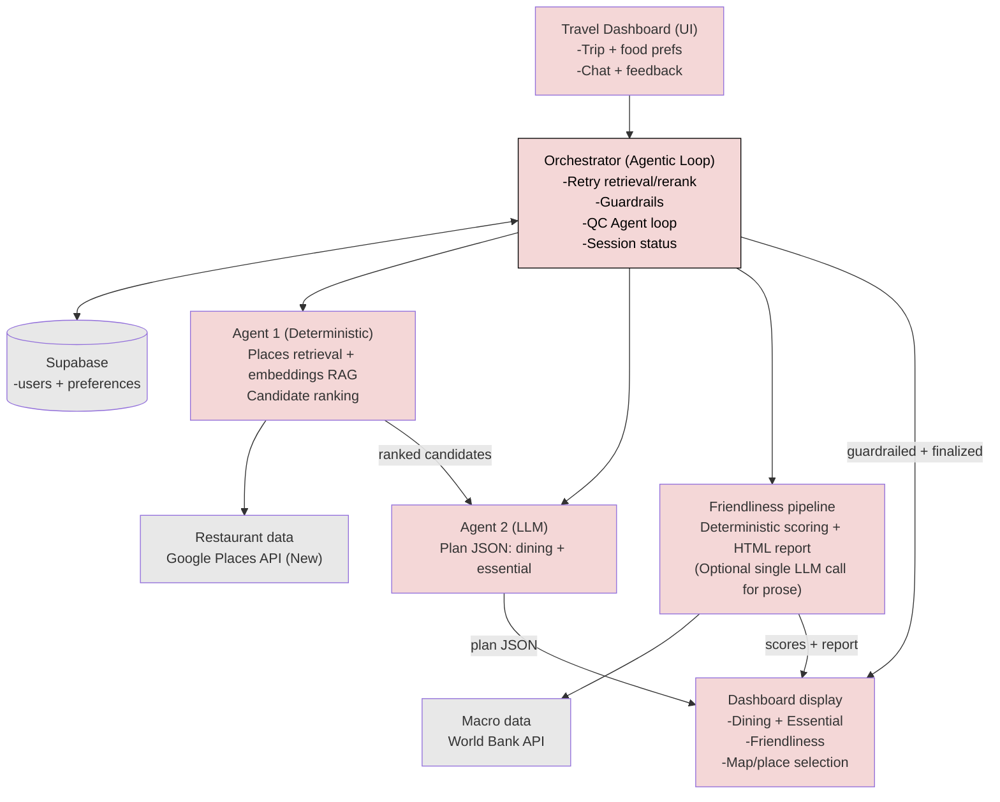

This doc is **Architecture V3** for TravelDashboard.

It updates the prior `docs/architecture.md` diagrams/terminology to reflect the implemented **agentic loop Orchestrator** that wraps the existing recommendation components.

Key terminology:
- **Agentic loop**: a bounded controller that runs Agent 1 + Agent 2 with deterministic validation/repair and a bounded QC loop (QC Agent).
- **Agent 1**: deterministic restaurant retrieval + embedding ranking (Google Places + local embedding similarity).
- **Agent 2**: plan LLM that produces the structured JSON used by the UI.
- **Friendliness pipeline**: mostly deterministic scoring + report generation (may include an optional single LLM call for prose). This is **not** an agentic loop.

---

## Target pipeline (Orchestrator + multi-component)

The Orchestrator runs **inside the Shiny app** (same UI) and controls whether to:
- rerun Agent 1 retrieval/rerank,
- call Agent 2 to draft a recommendation plan,
- apply hard guardrails (dietary + location) before any recommendation is shown,
- ask the user a targeted question to improve quality,
- stop and finalize,
- surface status/QC evidence in chat UI and status widgets.

---

## Responsibilities

### Orchestrator (agentic loop)
- **Hard guardrails** (no user feedback required)
  - **Dietary**: do not pass recommendations unless compliant; if uncertain, treat as non-compliant.
  - **Location**: do not pass venues outside the destination.
- **Quality loop**
  - Runs Agent 2 in bounded turns and retries on guardrail failures.
  - Runs QC Agent (up to 3 turns) and feeds QC evidence back to Agent 2 when needed.
  - Supports clarification state (`needs_clarification`) and chat refinements post-Generate.
- **Budgets**
  - LLM turns: default **min 2 / max 6**.
  - Deterministic retrieval reruns per request: bounded (`LoopBudgets.max_retrieval_reruns`, currently 6 from server calls).
  - QC Agent turns: max **3**.
- **Persistence / evidence**
  - Persists QC evidence logs to `shiny_app/data/qc_logs/`.
  - Uses Supabase for user/profile preferences; chat session continuity is primarily in reactive state.

### Agent 1 (existing)
- Google Places retrieval + Place Details + embedding similarity ranking.

### Agent 2 (existing)
- Produces the structured JSON plan used by the UI.

### Friendliness pipeline (existing; not agentic)
- Deterministic scoring from macro indicators; optional single LLM call for narrative prose.

---

## Current implementation mapping (Shiny)

- Agent 1: `shiny_app/restaurant_rag.py` + `shiny_app/google_places_client.py`
- Agent 2: `shiny_app/plan_logic.py` + `shiny_app/ollama_client.py` (invoked from `shiny_app/server.py`)
- Friendliness pipeline: `shiny_app/travel_friendliness/` (World Bank scoring + report)
- Orchestrator: `shiny_app/agent_loop.py` called from `shiny_app/server.py` Generate and chat-send handlers

