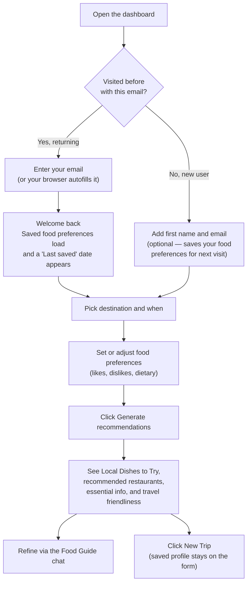

# Preference identity and save behavior — UX specification

This document is for **anyone who needs to understand the intended experience** when travelers save food preferences, return later, or generate recommendations without signing in. It describes **what people should see and why**, not how the software is built.

---

## Goals

- Let people use the dashboard **without a password or login screen**.
- Make it **clear** that preferences are tied to the **email they choose to enter** (transparent, honest copy).
- Welcome **returning travelers** by restoring their **last saved food preferences** when we recognize their email.
- Allow **Generate** to work even when someone has not (or chooses not to) share name and email—so exploration is never blocked by account friction.
- Keep a **simple mental model**: each save (or qualifying generate) is a **new snapshot** in history, not an overwrite of the past.

---

## User flow at a glance

This chart shows the typical end-to-end experience. New users and returning users differ only at the very start; from **Pick destination and when** onward, everyone follows the same path.

---

## Design principles

| Principle | What it means for users |
|-----------|-------------------------|
| **No accounts** | No registration, no password reset, no “log in.” The app opens ready to use. |
| **Email as chosen identity** | The email field is how we know “this is the same person again” when they come back. We say so plainly in the UI. |
| **History, not editing** | Saving does not replace old preferences in the database; it **adds** a new snapshot. The product story is “your latest saved preferences load when you return,” not “one editable record.” |
| **Optional identity for AI** | Recommendations can run from trip and food inputs alone. Name and email unlock **remembering** preferences for next time. |
| **Respect the device** | Browsers may offer autofill. We **scope** email/contact autofill so it does not accidentally fill **trip destination** country and city fields—those are travel choices, not mailing address. |

---

## First visit vs returning visitor

**First visit (or unrecognized email)**  
Trip and food fields behave as empty defaults. Nothing is assumed about who they are.

**Returning visitor (email we have seen before)**  
After they enter an email we can match:

- We load their **stored first name** (if we have it) and their **most recent saved food preferences** (tags and text).
- They see a short, positive confirmation—e.g. that we **welcomed them back** and **loaded their last preferences**—so the preload feels intentional, not magic or creepy.
- A **“Last saved: …”** line (date of that latest snapshot) helps them **trust** that the right profile loaded and notice if they **mistyped** their email (different email → different person in our model → no match or a blank slate).

**Timing**  
We wait until they have **paused typing** in the email field (about half a second) or **left the field** before we look up their profile. That avoids fetching on every keystroke and matches how people expect “I’m done typing my email” to behave.

**If the email does not match anyone**  
We do not show a harsh error; they simply stay on a **clean slate** until they save. There is no “did you mean…?” email correction in the current version.

---

## Matching email (what we consider “the same person”)

- **Same email, different typing** — Leading or trailing spaces and **capitalization** are ignored for matching (`Ada@Mail.com` and `ada@mail.com` are the same).
- **Behind the scenes (trust & consistency)** — For technical and privacy reasons, the system uses a **one-way fingerprint** of the normalized email to recognize returning users reliably. The **email they typed** remains what we care about for display and support; the fingerprint is for consistent matching.
- **Wrong email** — If someone uses a different address than before, they are treated as a **different identity**. The **Last saved** hint only appears when we actually loaded a saved snapshot for the current email.

---

## Save food preferences

**Required to save**

- First name  
- Email (must look like a valid email, including a domain with a dot, e.g. `name@example.com`)  
- Food-related text fields within the stated word limits  

**After a successful save**

- A clear **confirmation** that preferences were saved.
- Each save adds another **snapshot** in the database over time (append-only); the UI surfaces **your latest** snapshot when you return with the same email.

---

## Generate recommendations

| Situation | What happens |
|-----------|----------------|
| **Name, email, and food fields all valid** | We **save a new preference snapshot first**, then run the recommendation model. They get a normal success message for the updated outputs. |
| **Missing name or email, or invalid email** | We **do not** save a snapshot. We **still** run the model from their trip and food inputs so they can explore. After success, a **neutral** message explains they can **add name and email** if they want preferences **remembered for next time**. |
| **Food text over the limit** | We **do not** save and **do not** generate until they fix the text—same rules as Save, so limits feel consistent. |

This split is deliberate: **never block “try the trip planner”** on account details, but **reward** giving identity with persistence and preload.

---

## Copy and trust (on-screen)

These lines are part of the experience, not small print:

- **Encouragement (non-blocking)** — Near identity: idea that **first name + email** let us **save preferences for future visits**—without implying Generate is disabled without them.
- **Privacy / transparency** — Near email: we **use email to remember preferences on this device**—honest and scoped; we are not claiming a full account system.

---

## Device id (future-friendly, low visibility today)

On first visit in a browser, the app stores a **random id** locally (`localStorage`) as a **secondary signal** for **future** features (for example, a “continue as …?” style prompt). **Today it does not change** save, load, or preload behavior; **email remains the primary identity** for preferences.

Implementation note (current app): this device id is pushed to a hidden Shiny input (`device_id`) on connect so future flows can use it without changing the visible form behavior.

---

## Additional current behavior (implemented)

- **Generate collapses food inputs to a summary** with an "Edit food preferences" action; this helps keep the plan card compact after recommendations appear.
- **Identity (first name + email)** sits **above** food preferences in the plan card, with copy that name/email are optional and used to save/reload preferences for returning visitors.
- **New Trip** appears in a **full-width bar at the top of the page** only **after** at least one successful recommendation run (from **Generate** or the Food Guide **Send**). It clears destination and chat/session state, but keeps saved profile fields on the form for reuse. When recommendations are present, the plan card (Plan your trip, Identity, Food preferences, Generate) is hidden so users can iterate via the Food Guide chat or click **New Trip** to restart. Clicking **New Trip** restores the form.
- **Returning user preload trigger** uses both debounce (~500 ms after typing stops) and blur, matching the timing expectations above.

---

## Autofill and form behavior (Safari, Chrome, etc.)

Contact autofill should **fill identity fields** (e.g. name and email) **without** dumping the same profile into **destination country and city**. Those fields are **where the user is planning to go**, not their home address. The form is labeled and **autocomplete-scoped** so browsers are steered toward that distinction. Some browsers still behave oddly; the **intent** above is the design target.

---

## Explicitly out of scope (current version)

- **“Did you mean?”** email correction or merge of two addresses.
- **Modal “Continue as …?”** before typing email (possible later; would combine device signal with stored identity).
- **Editing** an old preference row in place—history stays **append-only**; new saves are new rows.

---

## Summary

The UX is designed around **optional, transparent identity**: email (and name) unlock **remembering** and **returning-user preload**, while **Generate** stays available for anonymous exploration. **Last saved** and **welcome-back** messaging reinforce **trust and clarity**; **Save vs Generate** rules keep behavior **predictable** and **fair** to both casual and returning travelers.
